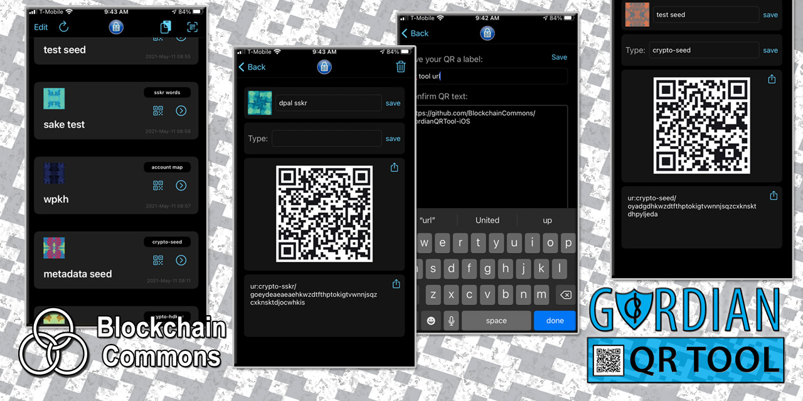

# Gordian QR Tool

### _by [Peter Denton](https://github.com/Fonta1n3) and [Christopher Allen](https://github.com/ChristopherA)_
*  ***part of the [gordian](https://github.com/BlockchainCommons/gordian/blob/master/README.md) technology family***

#### _This product has been deprecated because of issues with the iCloud storage. Please instead use **[Gordian Seed Tool](https://github.com/BlockchainCommons/GordianSeedTool-iOS)**._

**Gordian QRTool** is a reference tool that acts as a secure place to store and backup sensitive data that is encoded into QRs. Powered by [Uniform Resource](https://github.com/BlockchainCommons/Research/blob/master/papers/bcr-2020-005-ur.md), it was built to store SSKRs, PSBTs, and seeds encoded using [URs](https://github.com/BlockchainCommons/Research/blob/master/papers/bcr-2020-005-ur.md), however it can also be used to store other sorts of sensitive data such as 2FAs.

## Additional Information

Data is always stored with multiple layers of encryption using your device's keychain.

To ensure you can backup & recover from iCloud you **must** be signed in with the same Apple ID and must enable "Keychain" on your device's iCloud settings.

### Docs

- [**Manual**](Docs/MANUAL.md). A quick overview on using **Gordian QRTool**.

### Features

**Gordian QRTool** demonstrates security, usability, and interoperability best practices with a number of core features:

- Multiple layers of encryption
- Automated iCloud backup and recovery
- 2FA using the "Sign in with Apple" feature to ensure only you can decrypt your data
- Bitcoin centric! Convert plain text bip39 mnemonics, [SSKR](https://github.com/BlockchainCommons/bc-sskr) shards, PSBTs (more coming soon) into [UR](https://github.com/BlockchainCommons/Research/blob/master/papers/bcr-2020-005-ur.md) and stream them for airgapped use
- [LifeHashes](https://github.com/BlockchainCommons/LifeHash) to deterministically derive unique visual fingerprints of each item, always derived in real time before being displayed to make it obvious if your data has been altered
- Recognizes any UR type
- An ideal app to recommend to friends and family to backup SSKR shards
- Converts any amount of text into an animated UR QR code
- Scan a QR or paste text to create new items
- Easily build the project on your MacBook, iPhone iPad, iTouch using the same small codebase, or download the app directly from the Apple Store

## Gordian Principles

**Gordian QRTool** is a reference implementation meant to display the [Gordian Principles](https://github.com/BlockchainCommons/Gordian#gordian-principles), which are philosophical and technical underpinnings to Blockchain Commons' Gordian technology. This includes:

* **Independence.** QRTool allows you to store your own QR codes and Uniform Resources, giving you ultimate control over that data.
* **Privacy.** QRTool uses the same standards for privacy that Blockchain Commons applies to its pure cryptographic tools. Your data is encrypted and protected.
* **Resilience.** QRTool allows you to maintain copies of vital information such as cryptographic seeds, xprvs, and 2FAs.
* **Openness.** QRTool is built to support the interoperable [UR specification](https://github.com/BlockchainCommons/Research/blob/master/papers/bcr-2020-005-ur.md).

Blockchain Commons apps do not phone home and do not run ads. Some are available through various app stores; all are available in our code repositories for your usage.

## Status - Released (1.0.3)

**Gordian QRTool** has been released through the Apple Appstore.

## Version History

### 1.0.4 (3), July 21 2021

* Improved display of dense QRs
* Added SHC as a type

### 1.0.3 (3), July 14 2021

* Fixed bug where first cell being deleted didn't update on main listing if done from submenu
* Fixed bug where deleting a cell from the main menu didn't correctly update indexed array, resulting in crashes

### 1.0.2 (2), July 13 2021

* Fixed bug with deletable message cell causing crashes
 
### 1.0 (1)

* Fully featured release

## Installation Instructions

**Gordian QRTool** can be purchased for the iPhone from the [Apple Appstore](https://apps.apple.com/us/app/gordian-qr-tool/id1506851070) or can be compiled from the source here.

For full functionality of the iCloud backup, be sure to turn on the following functionality under "Settings > Apple ID > iCloud" on all devices running **Gordian QR Tool**:

* Keychain
* iCloud Drive

Be _very_ certain that all devices running **Gordian QR Tool** are fully logged into your Apple account, with full access to iCloud, and switches set as noted above. Failure to do so will either result in (1) QR entries not being synced to the iCloud (and other devices); or (1) QR entries being synced to other devices without the protected content of the actual code.

## Origin, Authors, Copyright & Licenses

Unless otherwise noted (either in this [/README.md](./README.md) or in the file's header comments) the contents of this repository are Copyright © 2020 by Blockchain Commons, LLC, and are [licensed](./LICENSE) under the [spdx:BSD-2-Clause Plus Patent License](https://spdx.org/licenses/BSD-2-Clause-Patent.html).

In most cases, the authors, copyright, and license for each file reside in header comments in the source code. When it does not we have attempted to attribute it accurately in the table below.

This table below also establishes provenance (repository of origin, permalink, and commit id) for files included from repositories that are outside of this repository. Contributors to these files are listed in the commit history for each repository, first with changes found in the commit history of this repo, then in changes in the commit history of their repo of their origin.

| File      | From                                                         | Commit                                                       | Authors & Copyright (c)                                | License                                                     |
| --------- | ------------------------------------------------------------ | ------------------------------------------------------------ | ------------------------------------------------------ | ----------------------------------------------------------- |
|  |  |  |  |                        |

### Dependencies

- [BCLibwallySwift](https://github.com/BlockchainCommons/BCLibwallySwift)
- [URKit](https://github.com/BlockchainCommons/URKit)
- [LifeHash](https://github.com/BlockchainCommons/LifeHash)

## Financial Support

**Gordian QRTool** is a project by [Blockchain Commons](https://www.blockchaincommons.com/). We are proudly a social benefit "not-for-profit" committed to open source & open development. Our work is funded entirely by donations and collaborative partnerships with people like you. Every contribution will be spent on building open tools, technologies & techniques for blockchain and internet security infrastructure.

To financially support further development of **Gordian QRTool** and other projects, please consider becoming a Patron of Blockchain Commons through ongoing monthly patronage by becoming a [Sponsor](https://github.com/sponsors/BlockchainCommons) through GitHub; currently they are matching the first $5k so please do consider this option. You can also offer support with Bitcoin via our [BTCPay Server](https://btcpay.blockchaincommons.com/).

## Contributing

We encourage public contributions through issues and pull-requests! Please review [CONTRIBUTING.md](./CONTRIBUTING.md) for details on our development process. All contributions to this repository require a GPG signed [Contributor License Agreement](./CLA.md).

### Discussions

The best place to talk about Blockchain Commons and its projects is in our GitHub Discussions areas.

[**Gordian User Community**](https://github.com/BlockchainCommons/Gordian/discussions). For users of the Gordian reference apps, including [Gordian Coordinator](https://github.com/BlockchainCommons/iOS-GordianCoordinator), [Gordian Seed Tool](https://github.com/BlockchainCommons/GordianSeedTool-iOS), [Gordian Server](https://github.com/BlockchainCommons/GordianServer-macOS), [Gordian Wallet](https://github.com/BlockchainCommons/GordianWallet-iOS), and [SpotBit](https://github.com/BlockchainCommons/spotbit) as well as our whole series of [CLI apps](https://github.com/BlockchainCommons/Gordian/blob/master/Docs/Overview-Apps.md#cli-apps). This is a place to talk about bug reports and feature requests as well as to explore how our reference apps embody the [Gordian Principles](https://github.com/BlockchainCommons/Gordian#gordian-principles).

[**Blockchain Commons Discussions**](https://github.com/BlockchainCommons/Community/discussions). For developers, interns, and patrons of Blockchain Commons, please use the discussions area of the [Community repo](https://github.com/BlockchainCommons/Community) to talk about general Blockchain Commons issues, the intern program, or topics other than those covered by the [Gordian Developer Community](https://github.com/BlockchainCommons/Gordian-Developer-Community/discussions) or the 
[Gordian User Community](https://github.com/BlockchainCommons/Gordian/discussions).
### Other Questions & Problems

As an open-source, open-development community, Blockchain Commons does not have the resources to provide direct support of our projects. Please consider the discussions area as a locale where you might get answers to questions. Alternatively, please use this repository's [issues](./issues) feature. Unfortunately, we can not make any promises on response time.

If your company requires support to use our projects, please feel free to contact us directly about options. We may be able to offer you a contract for support from one of our contributors, or we might be able to point you to another entity who can offer the contractual support that you need.

### Credits

The following people directly contributed to this repository. You can add your name here by getting involved — the first step is to learn how to contribute from our [CONTRIBUTING.md](./CONTRIBUTING.md) documentation.

| Name              | Role                | Github                                            | Email                                 | GPG Fingerprint                                    |
| ----------------- | ------------------- | ------------------------------------------------- | ------------------------------------- | -------------------------------------------------- |
| Christopher Allen | Principal Architect | [@ChristopherA](https://github.com/ChristopherA) | \<ChristopherA@LifeWithAlacrity.com\> | FDFE 14A5 4ECB 30FC 5D22  74EF F8D3 6C91 3574 05ED |
| Peter Denton | Project Lead | [@Fonta1n3](https://github.com/@Fonta1n3) | \<fonta1n3@protonmail.com\> | 3B37 97FA 0AE8 4BE5 B440 6591 8564 01D7 121C 32FC |

## Responsible Disclosure

We want to keep all our software safe for everyone. If you have discovered a security vulnerability, we appreciate your help in disclosing it to us in a responsible manner. We are unfortunately not able to offer bug bounties at this time.

We do ask that you offer us good faith and use best efforts not to leak information or harm any user, their data, or our developer community. Please give us a reasonable amount of time to fix the issue before you publish it. Do not defraud our users or us in the process of discovery. We promise not to bring legal action against researchers who point out a problem provided they do their best to follow the these guidelines.

### Reporting a Vulnerability

Please report suspected security vulnerabilities in private via email to ChristopherA@LifeWithAlacrity.com (do not use this email for support). Please do NOT create publicly viewable issues for suspected security vulnerabilities.

The following keys may be used to communicate sensitive information to developers:

| Name              | Fingerprint                                        |
| ----------------- | -------------------------------------------------- |
| Christopher Allen | FDFE 14A5 4ECB 30FC 5D22  74EF F8D3 6C91 3574 05ED |

You can import a key by running the following command with that individual’s fingerprint: `gpg --recv-keys "<fingerprint>"` Ensure that you put quotes around fingerprints that contain spaces.
